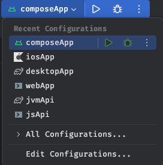

# CashConv

[](docs/unit-test/index.html)

## Platforms

All platforms can be ran from the android studio run button as shown below 




### Android


### iOS


### Desktop


### JS Browser


#### Setup

run 

```shell
cd webApp
```
then 

```shell
yarn rs
```

### JS Backend


#### setup
run

```shell
cd jsApi
```
then

```shell
yarn rs
```

### Jvm


#### Setup 

run 

```shell
./gradlew bootRun
```

## Structure 

This is a Kotlin Multiplatform project targeting Android, iOS, Desktop, Web, Jvm , NodeJS.

* `/composeApp` is for code that will be shared across your Compose Multiplatform applications.
  It contains several subfolders:
  - `commonMain` is for code that’s common for all targets.
  - Other folders are for Kotlin code that will be compiled for only the platform indicated in the folder name.
    For example, if you want to use Apple’s CoreCrypto for the iOS part of your Kotlin app,
    `iosMain` would be the right folder for such calls.

* `/iosApp` contains iOS applications. Even if you’re sharing your UI with Compose Multiplatform,
  you need this entry point for your iOS app. This is also where you should add SwiftUI code for your project.

* `/webApp` contains react web applications. UI is not shared but business logic is shared
* `/jvmApi` contains Sprint boot java applications. uses same business logic to support converting end point
* `/jsApi` contains Express nodeJs applications. uses same business logic to support converting end point


### [Models](models)

Module to add models (pojos), to be shared later with any frontend/backend platform who will be working with this project data

### [Client])(lib)

Module that holds all the business logic and layers 

- Data (cache)
  - The cached used in key/value for due to the assignment nature
  - SQLDelight setup is [provided](lib/src/commonMain/sqldelight) but disabled   
- Networking
- Processing

Its multiplatform so it can be used on both front and backend applications (APIs)

### [App](composeApp)

Module that holds the UI part of the project that can support 

* Android
* iOS
* Desktop

## [Docs](docs)

Both client and models are documented using dokka
* [Client docs](docs/client/index.html)
* [Models docs](docs/models/index.html)

## Unit Testing

Unit testing the business logic which will be in [client](lib)

Each layer is tested 

* models
* cache
* remote
* repositories
* manger

All api calls are mocked and responses can be found [here](lib/src/commonTest/resources) 

Framework used 

* [kotest](https://kotest.io/)
* [kover](https://github.com/Kotlin/kotlinx-kover)

[Code coverage report](docs/unit-test/index.html)

To make sure that converting logic is resilient to code changes a snapshot of all possible conversions is created [here](lib/src/commonTest/resources/conversions)

To Generate this snapshot run [Conversions.generateConversionTable](lib/src/androidUnitTest/kotlin/Conversions.kt) 

## Screenshot Testing

By Using [Shot](https://github.com/pedrovgs/Shot) we can do screenshot testing for our UI to make sure our changes do not break the UI or cause unwanted effect

Screenshots can be found [here](composeApp/screenshots)

When recoding and verify we need to use the same emulator , 

Gradle tasks are provided to make sure to download the same emulator spec on new devices 

Make sure the following are done 
* Update to latest android sdk
* Update/Install Android sdk command tools
* Setup ANDROID_HOME globally
* Turn off all emulator and disconnect all physical devices

### Record

```shell
./gradlew shotDebugExecuteScreenshotTests -Precord 
```
### Verify

```shell
./gradlew shotDebugExecuteScreenshotTests 
```

## Flavors 

Added flavor to android app project due to an issue in shot integration where we have to use `sharedUserId` that was causing issue with kmp resources resolving (flags)

* normal
* shot


## Assemble

### Android

```shell  
./gradlew assembleNormalRelease
```

### iOS

```shell
cd iosApp
```

#### Simulator

```shell    
xcodebuild -project 'iosApp.xcodeproj' -scheme 'iosApp' -sdk iphonesimulator -configuration Release SYMROOT="$(PWD)/build" -quiet
```

#### Zip 

```shell  
cd iosApp && zip -r build/CashConv.zip build/Release-iphonesimulator/CashConv.app
```


